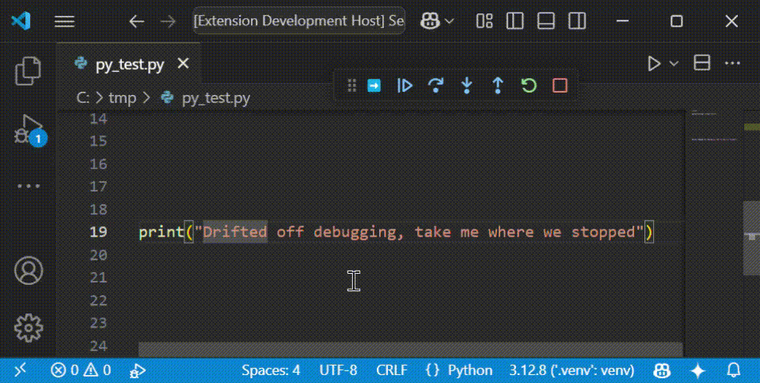

# Debugger: Go to Current Line

Do you find yourself deep into the source, debugging and just quickly want to return back to where the debugger is waiting?

If yes, this extension is for you. It adds a button to the debug toolbar

## Demo

## Requirements

No known requirements. Just realise that this button sits in the debugger toolbar, which only kicks in during debugging.

If also uses the built-in VS Code command `workbench.action.debug.callStackTop` and your specific debugger should support it.

## Known Issues

Unaware of issues

## Release Notes

### 1.0.0

Initial release of this extension.
